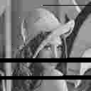
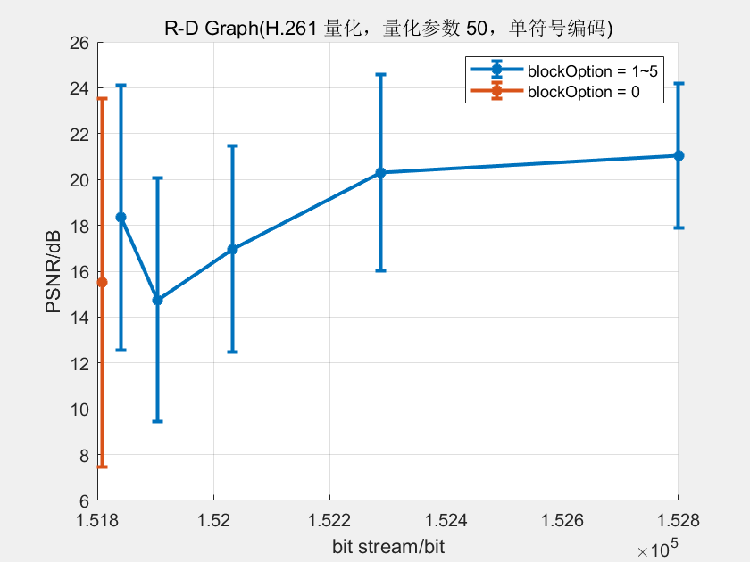
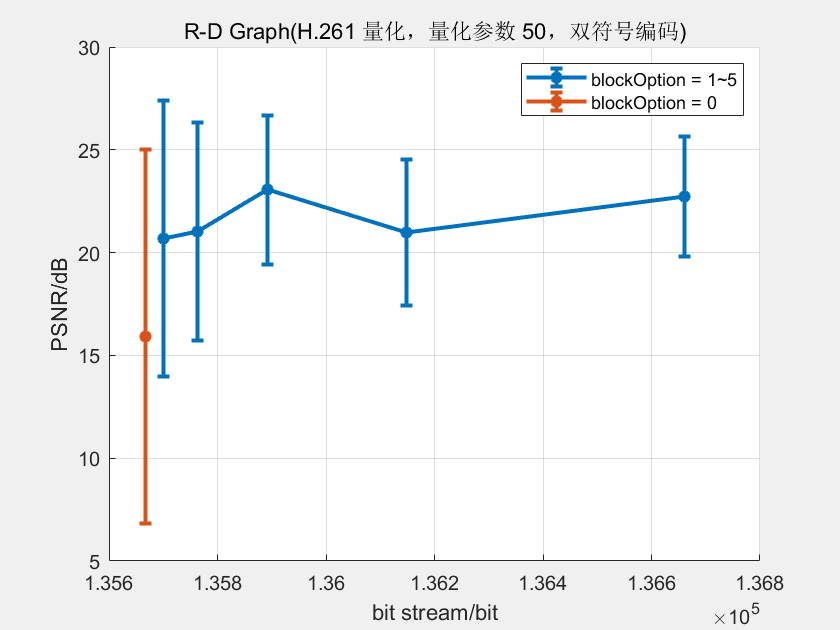

# 信源和信道编码联合调试

复用了实验二的代码：将编码后产生的码流从 `bin.txt` 中读出，经过实验二中的信道进行传输后写回文件 `bin_with_noise.txt`，并再次读回码流进行解码。

信道编码在 `channelEncode.m` 中实现；利用 `awgn` 对得到的连续时域波形按指定信噪比添加噪声后，再在 `channelDecode.m` 中还原回原码流供信道解码使用。

## 信源信道编码联合调试

没有使用卷积码；使用了 2ASK 的电平映射方式。选择信道的信噪比 $SNR = 10$。取其它信源编码参数为 `i_quant=1, quant_factor = 50, escape_prob_threshold = 0.9`。

典型的错误图案如图 

在 `vlcRadio=0,1`，`blockOption=0,1,2,3,4,5` 的十二种组合下分别执行了代码，将所得结果绘制成了 R-D 图。对每组参数执行了十二次重复试验，并将结果的 PSNR 取平均值。图中标注了各组数据的均值和一倍标准差。

### 单符号和双符号
* 双符号编码的码长更小。
* 双符号编码在码流比特率较高（即条带高度较小）时表现略好于单符号编码。（在条带高度较小时，一个条带中出现的错误很快就能被下一个条带纠正过来，因此 PSNR 受控于条带中错误的出现概率。而对于双符号编码而言，由于其码流较短，因此出现错误的概率也就略低，从而导致最终 PSNR 略高于单符号编码。）

### 条带高度
* 不使用条带时 PSNR 最低，且标准差最大、表现最不稳定：这是因为此时信源解码处没有任何纠错机制，因此一个像素的错误就会影响从此往后的整张图片。而错误又均等地可能出现在任何地方，因此使得解码的表现变得十分差而且不稳定。
* 条带较窄时 PSNR 较高且表现稳定，条带较宽时 PSNR 较低且不太稳定：原因与上条相同。当条带较宽时，对错误的恢复很慢，因此一个错误可能影响到的范围大大增加，使得表现恶化、稳定性较差。
* 不使用条带时码流比特率最小；使用条带时，条带越窄码流比特率越大：这是因为图像的大小一定，于是条带较窄时条带数量增多，使得 `slice_start_code` 的数量增多，最终码流变长。

## 信源信道编码联合策略分析

不使用卷积码、并使用 2ASK 电平映射方式，选择 H.261 量化方式、双符号编码、逃逸码总概率占比 $0.9$、条带高度取 $4$，在量化参数 `quant_factors=[5,10,50,100]` 的条件下分别进行试验。每组试验仍然是取 10 次重复试验的平均值和一倍标准差。得到基准曲线

使用 $1/2, 1/3$ 效率卷积码，重复以上操作得到结果

可见 PSNR 明显提升，传输效果明显编号。